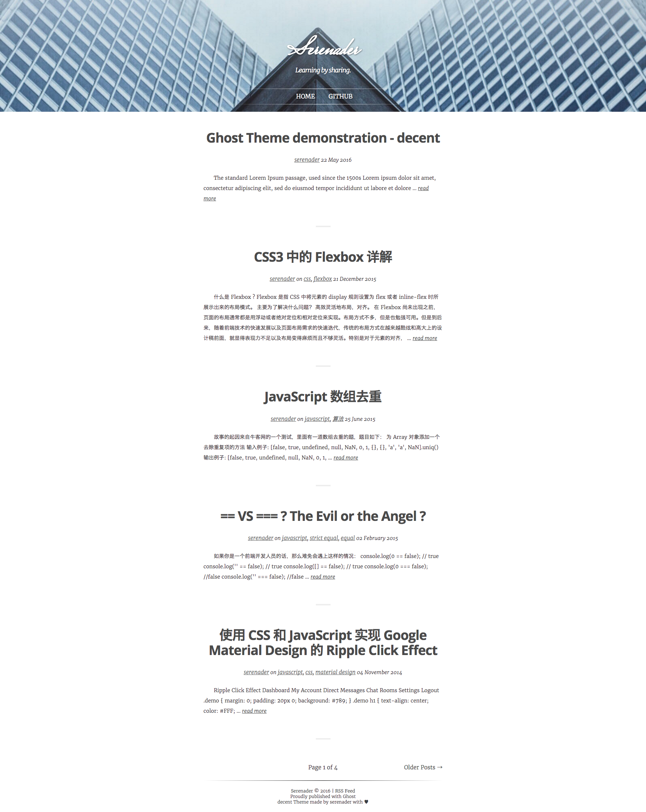
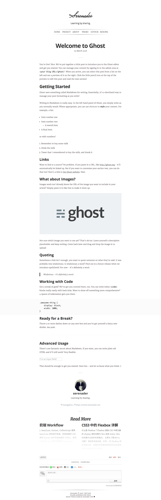
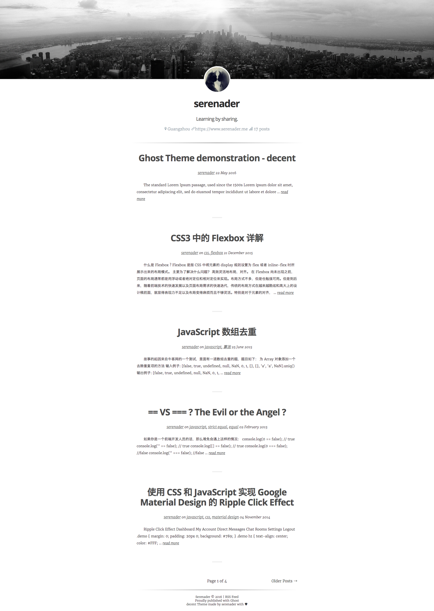
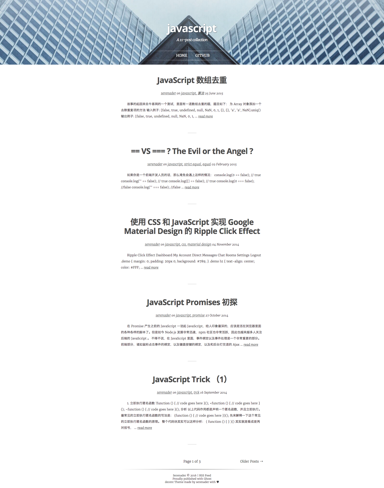
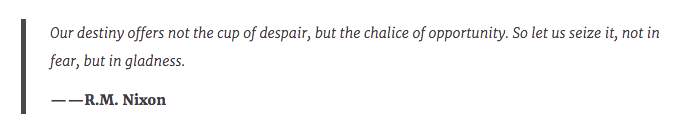
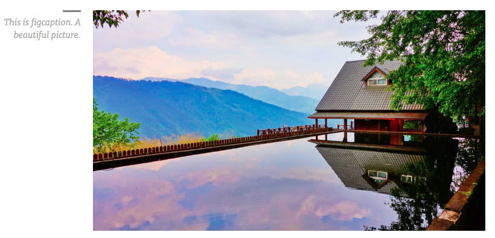
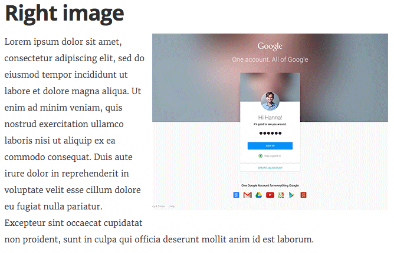
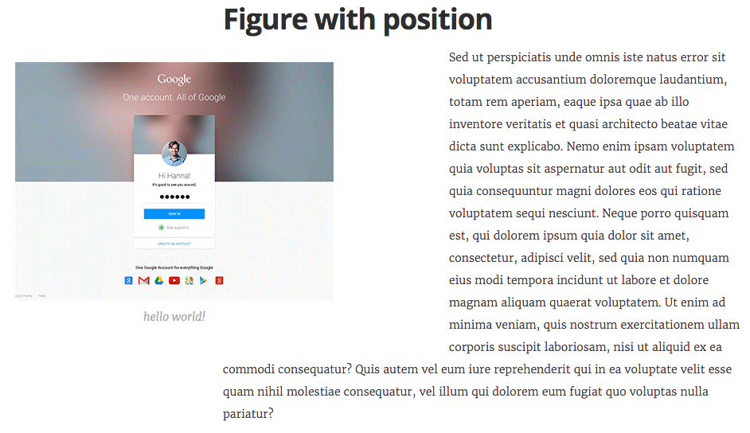
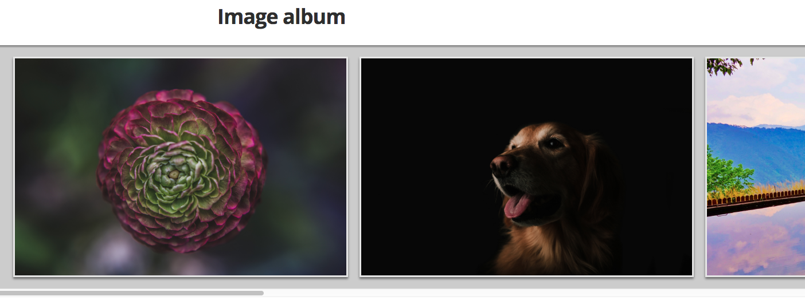
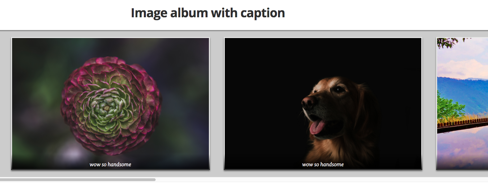

# decent

A Ghost blog theme, modified from [Casper](https://github.com/TryGhost/Casper). The main design is inspired by [Aquila](https://github.com/lxndio/Aquila).

Demo: [my blog](https://blog.serenader.me)

# ToC

- [Features](#features)
- [Screenshot](#screenshot)
    - [Home page](#home-page)
    - [Post page](#post-page)
    - [Author page](#author-page)
    - [Tag page](#tag-page)
- [Installation](#installation)
- [Configuration](#configuration)
    - [Google Analytics service configuration](#google-analytics-service-configuration)
    - [Duoshuo comment service configuration](#duoshuo-comment-service-configuration)
    - [Disqus comment service configuration](#disqus-comment-service-configuration)
    - [How to enable syntax highlighting](#how-to-enable-syntax-highlighting)
- [Writing markdown](#writing-markdown)
    - [How to add author to quote](#how-to-add-author-to-quote)
    - [How to add image with caption](#how-to-add-image-with-caption)
    - [How to add image with alignment](#how-to-add-image-with-alignment)
    - [How to add image with caption and with alignment](#how-to-add-image-with-caption-and-with-alignment)
    - [How to add fullscreen image](#how-to-add-fullscreen-image)
    - [How to add fullscreen image with caption](#how-to-add-fullscreen-image-with-caption)
    - [How to add image gallery(album)](#how-to-add-image-galleryalbum)
    - [How to add image gallery(album) with caption](#how-to-add-image-galleryalbum-with-caption)
- [Development](#development)
- [Thanks to](#thanks-to)
- [License](#license)

## Features

- Minimalist design, less is more.
- Syntax highlighting.
- Responsive deign.
- Quote with author supported.
- Image caption supported.
- Image alignment supported.
- Image gallery supported.
- Google Analytics service.
- Duoshuo comment service.
- Disqus comment service.
- All Optional services can be configured in the Ghost admin page, you don't have to manually modify the code.

## Screenshot

### Home page



### Post page



### Author page



### Tag page



## Installation

1. Download this theme from [Github release page](https://github.com/serenader2014/decent/releases), and extract the files to the Ghost's theme folder: `content/themes`.
2. Restart Ghost: `pm2 restart ghost` (assume you're using pm2)
3. In the Ghost admin page, navigate to `General` section, change the theme to `decent`
4. In the Ghost admin page, navigate to `Code Injection` section, add some configurations, for example, add Google Analytics service or Duoshuo comment service.
5. Everything is done. Just visit your blog's home page to enjoy the theme.

## Configuration

In the Ghost admin page, navigate to the `Code Injection` section, create a script tag, and create a global object named `decentThemeConfig`. This object is needed as the third party serivce's configuration will define in this object.

```html
<script>
    var decentThemeConfig = {};
</script>
```

### Google Analytics service configuration

Add a `ga` key to the `decentThemeConfig` object, and set its value to your Google Analytics track id.

```html
<script>
    var decentThemeConfig = {
        ga: 'YOUR TRACK ID'
    };
</script>
```

### Duoshuo comment service configuration

Add a `duoshuo` key to the `decentThemeConfig` object, and set its value to your Duoshuo service's short name.

```html
<script>
    var decentThemeConfig = {
        duoshuo: 'YOUR DUOSHUO SHORT NAME'
    };
</script>
```

### Disqus comment service configuration

Add a `disqus` key to the `decentThemeConfig` object, and set its value to your disqus service's short name.

```html
<script>
    var decentThemeConfig = {
        disqus: 'YOUR DISQUS SHORT NAME'
    };
</script>
```


> #### What is my disqus short name?
> 
> When you're setting up your disqus account, it will ask you to create a unique Disqus URL, and this URL will also become your site's "shortname". For example, my Disqus URL is: `https://serenader.disqus.com`, so my shortname is 'serenader'.

### How to enable syntax highlighting

[decent](https://github.com/serenader2014/decent) use [Prism.js](http://prismjs.com/index.html) to support the syntax highlighting, it's easy to work with Ghost.

In your markdown content, you just need to specify your code block's language, like this:


    ```html
    <script>
        var decentThemeConfig = {
            ga: 'YOUR TRACK ID'
        };
    </script>
    ```

    ```javascript
    Array.prototype.uniq = function () {
        var map = {};
        return this.filter(function (item) {
            if (map[item]) {
                return false;
            } else {
                map[item] = true;
                return true;
            }
        });
    };
    ```

And it's done! 

Default supported languages are:

- Markup
- CSS
- C-like
- JavaScript
- Bash
- C
- C#
- C++
- CoffeeScript
- CSS Extras
- Docker
- Elixir
- Erlang
- Git
- Go
- Handlebars
- HTTP
- Jade
- JSON
- Less
- Makefile
- Markdown
- Nginx
- Objective-C
- Perl
- PHP
- PHP Extras
- Powershell
- Python
- React JSX
- Ruby
- Rust
- Sass(Sass/Scss)
- Swift
- TypeScript
- Vim

If you want to add more language support, follow these instructions:

1. Go to [Prism.js download page](http://prismjs.com/download.html), and select the language that you want to enable, and click download, then place the file in `Ghost/content/themes/decent/assets/js`.
2. Delete the old `bundle.min.js`.
3. In the decent theme folder, run `npm install`, and run `gulp js`.
4. It's done! Restart your Ghost and see the result.

## Writing markdown

### How to add author to quote

Just add a `<cite></cite>` tag below your quote. 

Demo: [Post page demostration](https://blog.serenader.me/ghost-theme-demostration-decent-2/#thestandardloremipsumpassageusedsincethe1500s)

```markdown
> Our destiny offers not the cup of despair, but the chalice of opportunity. So let us seize it, not in fear, but in gladness.
> 
> <cite>——R.M. Nixon</cite>
```



### How to add image with caption

Wrap your image with a `<figure></figure>` tag, and place your caption in a `<figcaption></figcaption>` tag. 

Demo: [Post page demostration](https://blog.serenader.me/ghost-theme-demostration-decent-2/#section11032ofdefinibusbonorumetmalorumwrittenbyciceroin45bc)

```markdown
<figure>

<figcaption>This is figcaption. A beautiful picture.</figcaption>
</figure>
```



### How to add image with alignment

Add a hash that contain alignment in your image's url. 

Demo: [Post page demostration](https://blog.serenader.me/ghost-theme-demostration-decent-2/#section11032ofdefinibusbonorumetmalorumwrittenbyciceroin45bc)

```markdown


```



### How to add image with caption and with alignment

Simply add a class `left` or `right` to your `<figure></figure>` tag. 

Demo: [Post page demostration](https://blog.serenader.me/ghost-theme-demostration-decent-2/#section11033ofdefinibusbonorumetmalorumwrittenbyciceroin45bc)

```markdown
<figure class="left">

<figcaption>hello world!</figcaption>
</figure>
```



### How to add fullscreen image

Wrap your image with an element that has a `large` class. 

Demo: [Post page demostration](https://blog.serenader.me/ghost-theme-demostration-decent-2/)

```markdown
<div class="large">

</div>
```

### How to add fullscreen image with caption

Give your `<figure></figure>` a `large` class. 

Demo: [Post page demostration](https://blog.serenader.me/ghost-theme-demostration-decent-2/#1914translationbyhrackham)

```markdown
<figure class="large">

<figcaption>wow so handsome</figcaption>
</figure>
```

### How to add image gallery(album)

Place your images within an element that has a `album` class. 

Demo: [Post page demostration](https://blog.serenader.me/ghost-theme-demostration-decent-2/#imagegallery)

```markdown
<div class="album">


</div>
```



### How to add image gallery(album) with caption

Just like image gallery, place your `<figure></figure>` tags instead of images in an element that has a `album` class. 

Demo: [Post page demostration](https://blog.serenader.me/ghost-theme-demostration-decent-2/#imagegallerywithcaption)

```markdown
<div class="album">
<figure>

<figcaption>wow so handsome</figcaption>
</figure>

<figure>

<figcaption>wow so handsome</figcaption>
</figure>

<figure>

<figcaption>wow so handsome</figcaption>
</figure>

<figure>

<figcaption>wow so handsome</figcaption>
</figure>

<figure>

<figcaption>wow so handsome</figcaption>
</figure>

<figure>

<figcaption>wow so handsome</figcaption>
</figure>

<figure>

<figcaption>wow so handsome</figcaption>
</figure>
</div>
```



## Development

- Fork this project, and clone it to Ghost theme's folder.
- Run `npm install` to install dependencies.
- Run `gulp` to start development(make sure your Ghost is running, and you have set decent as your Ghost's theme.)

[Gulp](http://gulpjs.com) will watch your files' changes, and automatically generate the bundle file, like `screen.css` and `bundle.min.js`. So you don't need to build these files by yourself. And when the bundle file changes, the browser will automatically reload itself, to see the latest changes.

## Thanks to

- [Ghost](https://ghost.org)
- [Casper](https://github.com/TryGhost/Casper)
- [Aquila](https://github.com/lxndio/Aquila)
- [Prism.js](http://prismjs.com/index.html)
- [Photoswipe](http://photoswipe.com/)
- [Duoshuo](http://duoshuo.com/)
- [Disqus](https://disqus.com/)

## License

MIT
